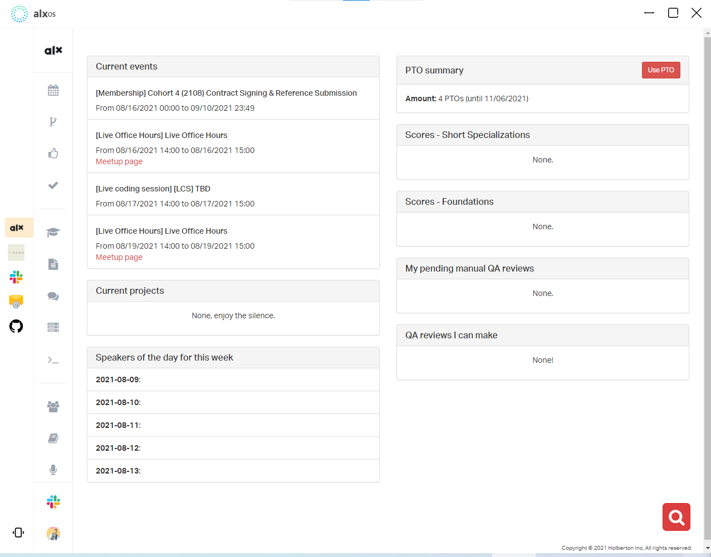
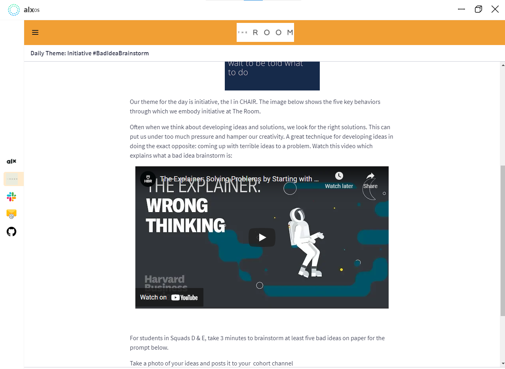
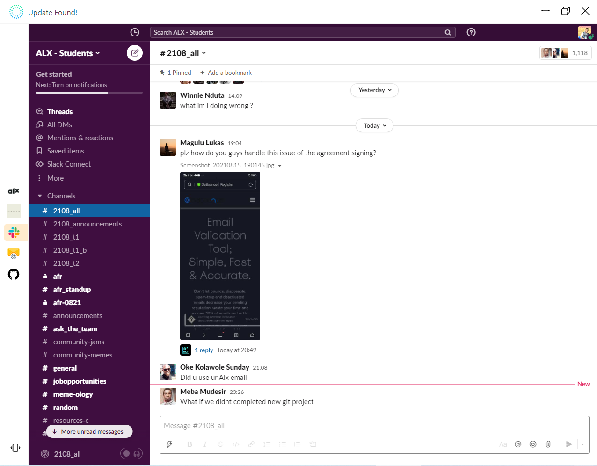
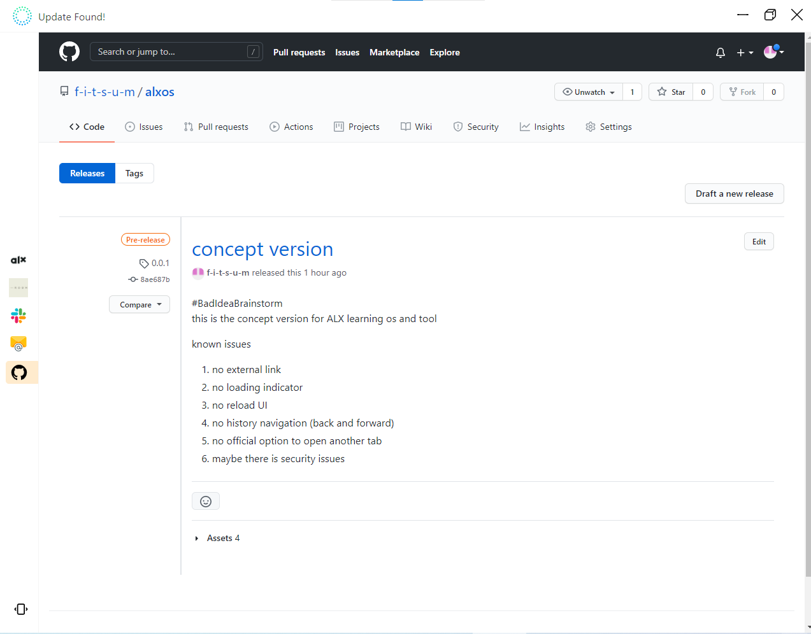

# #BadIdeaBrainstorm #
## concept version ##

ALX community App from the community

This is a bad idea brainstorm project just to show this can be done for good.

### What is this app ###

from my participation in the ALX SE program, things became so difficult to follow up because the courses and announcements and project tasks, etc broadcast on different channels and websites. THIS APP WILL REDUCE THE TIME AND MAKE YOUR NAVIGATION WITHOUT DISTRACTION

## GOAL OF THE APP ##

the goal of this app is to create a STRONG COMMUNITY BACKED ALX PROGRAM DEFAULT LAUNCHER OR BROWSER.
It took me 1 day to read and deploy this simple app.
The app could play a big role in the working and learning environment for ALX participants.

the limit is our imagination.

### hey fitsum why can't you use a browser with bookmarks or pin them on top? ###

yes, I can! but still not comfortable and since this is a bad idea Brainstorm I just to demonstrate my solution for my problem.

## Tools and Plugins for the project ##
1. I use Electronjs 
2. Electron-Tabs for the navigations
3. Uaup-js to update the app over the network

###  Next Realse ###

I don't know maybe in my free time and if you want to contribute to this project feel free since this project is for ALX community App from the community

### Proff of concept ###

